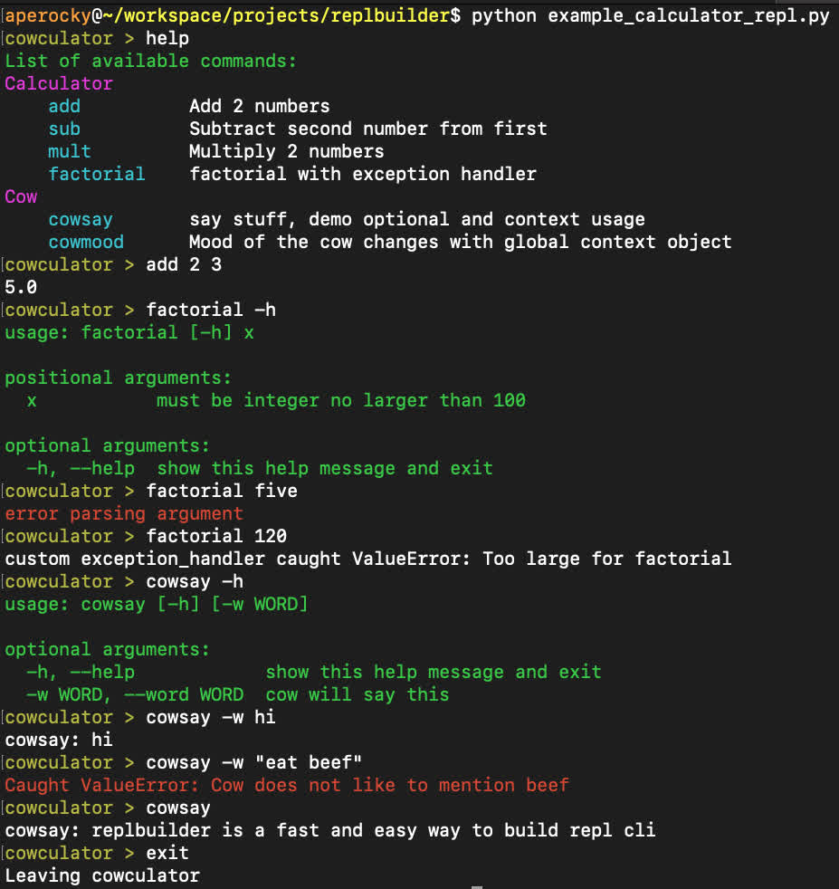

## ReplBuilder

`pip install replbuilder`

Quickly build a repl cli prompt for custom commands in python.

`argparse` is used for quick and easy parsing interface, some options are overriden for using it within a repl prompt. But you should be able to utilize the full power of `argparse` as your repl parser.

A globally scoped context object can be optionally passed into each command, making context sharing and state possible.

Each command can also accomodate optional custom exception handler, allowing for the same exception handler to be passed into multiple different commands.

## Example

see [example calculator repl](example_calculator_repl.py) for example implementation. The gist can be concluded in a few lines:

```
add_cmd = ReplCommand("add", Calculator.basic_parser(), calculator.add, "Add 2 numbers")
sub_cmd = ReplCommand("sub", Calculator.basic_parser(), calculator.sub, "Subtract second number from first")
fact_cmd = ReplCommand("factorial", Calculator.factorial_parser(), calculator.factorial, "factorial with exception handler", exception_handler=exception_handler)
say_cmd = ReplCommand("cowsay", Cow.get_cowsay_parser(), cow.cowsay, "say stuff, demo optional and context usage", use_context=True)
mood_cmd = ReplCommand("cowmood", argparse.ArgumentParser(), cow.cowmood, "Mood of the cow changes with global context object", use_context=True)
calc_commands = [add_cmd, sub_cmd, fact_cmd]
cow_commands = [say_cmd, mood_cmd]

context = ContextObj()
runner = ReplRunner("calculator", context) # context is optional, but it helps maintaining state and avoiding duplicate work.
runner.add_commands(calc_commands, namespace="Calculator") # namespace is optional
runner.add_commands(cow_commands, namespace="Cow")
runner.run()
```

run it `python example_calculator_repl.py`

Part of the repl is colorized for better visibility:


